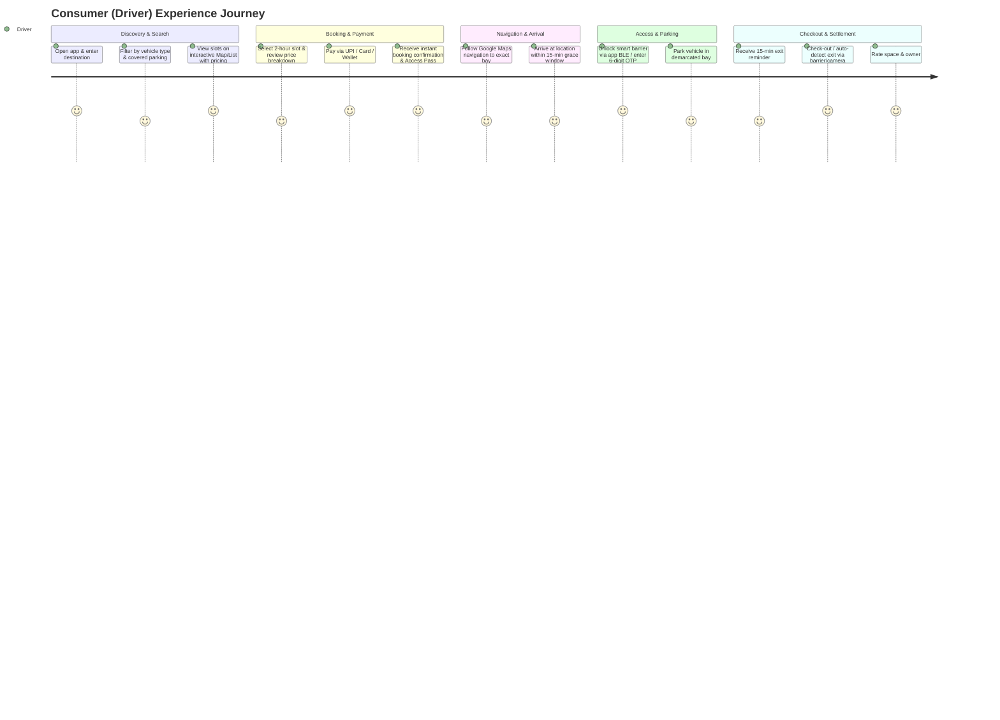
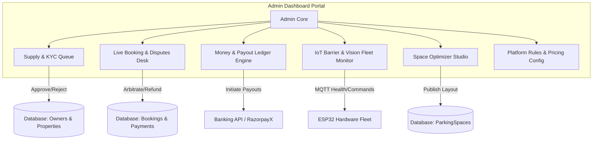

# Parkfnb — Product Requirements Document (PRD)
## Focus: User Personas, Owner Personas & Admin Personas

**Document Version:** 1.0  
**Status:** Approved for Implementation  
**Market Focus:** India Tier-2 & Tier-1 Urban Cores (Pilot: Indore, Madhya Pradesh)  
**Ecosystem Components:** Consumer Mobile App (React Native), Space Owner Mobile App (React Native + TS), Admin Web Portal (React + Vite), Backend (Express 5 + MongoDB), IoT Barrier Hardware (ESP32), Space Optimizer (Geometry Engine).

---

## 1. Executive Summary & Product Vision

**Parkfnb** is an urban parking operating layer designed to digitize, control, and monetize fragmented parking capacity. The platform bridges three distinct stakeholders:
1. **Drivers / Consumers (Demand Side):** Need advance certainty, fast booking, frictionless physical access, and transparent pricing in congested hubs.
2. **Space Owners / Commercial Operators (Supply Side):** Need passive income generation, anti-squatting security, flexible availability controls, and automated settlement without operational overhead.
3. **Platform Administrators & Operations Teams (Control Plane):** Need KYC verification, dispute arbitration, hardware fleet monitoring, city-level supply-demand balancing, and financial reconciliation.

```
       ┌───────────────────────────────┐
       │   DRIVERS / CONSUMERS (B2C)   │
       │   Find · Reserve · Navigate   │
       │     Unlock · Park · Pay       │
       └───────────────┬───────────────┘
                       │
       ┌───────────────▼───────────────┐        ┌─────────────────────────────┐
       │     PARKFNB CONTROL PLANE     │◄───────┤    PLATFORM ADMINS (OPS)    │
       │   Single Auth · State Engine  │        │   KYC · Disputes · Payouts  │
       │   Ledger · Pricing · Access   │        │   Fleet Health · Optimizer  │
       └───────────────▲───────────────┘        └─────────────────────────────┘
                       │
       ┌───────────────┴───────────────┐
       │    SPACE OWNERS & OPERATORS   │
       │   List · Schedule · Protect   │
       │     Verify Pass · Earn 70%    │
       └───────────────────────────────┘
```

---

## 2. Persona 1: Driver / Consumer (Demand Side)

### 2.1 Persona Archetypes

#### Archetype 1A: "The Daily Corporate Commuter" (Amit Sharma, 31)
- **Role & Profile:** Senior Software Engineer at an IT park (e.g., Crystal IT Park / Super Corridor, Indore).
- **Vehicle:** Compact SUV / Sedan (Hyundai Creta, Tata Nexon) or EV.
- **Behavior & Routine:** Mon–Fri 9:30 AM to 6:30 PM. Drives 12 km daily.
- **Primary Pain Points:**
  - Official office parking is full by 9:15 AM.
  - Circles nearby commercial roads for 20–25 minutes ("cruising waste").
  - Street parking risks scratches, police towing, or bird droppings.
- **Jobs to be Done (JTBD):**
  - *"When I leave home for work, I want to pre-book a guaranteed parking bay within 300 meters of my office on a weekly/monthly recurring schedule, so that I never get late for my morning standup."*
- **Key Feature Needs:**
  - Recurring / Daily Pass booking.
  - Proximity filter & walking distance indicator.
  - Covered / EV-charging filter.
  - Seamless auto-checkin via BLE or 6-digit access code.

#### Archetype 1B: "The High-Street Shopper / Diner" (Priya Patwardhan, 27)
- **Role & Profile:** Marketing Consultant, visits commercial/food hubs on weekends (56 Dukan, Sarafa, Chappan, Phoenix Citadel).
- **Vehicle:** Hatchback (Maruti Swift / Baleno) or Two-Wheeler (Activa).
- **Behavior & Routine:** Fri evening & Sunday afternoon. Trips are spontaneous or planned 1–2 hours prior.
- **Primary Pain Points:**
  - Chaos during peak hours (7 PM–10 PM); valet queues take 30 mins.
  - Cash-only informal parking attendants charging arbitrary rates (₹50–₹100) with no receipts.
  - Fear of vehicle getting boxed in by double-parked cars.
- **Jobs to be Done (JTBD):**
  - *"When I am driving into a bustling market area with friends or family, I want to see real-time open slots and reserve one 15 minutes ahead, so that I can park straight away without anxiety."*
- **Key Feature Needs:**
  - Instant Book mode (no waiting for owner manual approval).
  - Quick UPI checkout (PhonePe, GPay, Paytm) + in-app wallet.
  - Turn-by-turn map navigation directly to the specific bay/gate.
  - Easy extension request if dinner/shopping runs late.

#### Archetype 1C: "The Outstation Pilgrim / Tourist" (Rajesh Verma, 48)
- **Role & Profile:** Business owner traveling with family from Bhopal to Ujjain / Mahakaleshwar via Indore.
- **Vehicle:** Large 7-seater MPV/SUV (Toyota Innova Hycross / Mahindra XUV700).
- **Behavior & Routine:** Weekend trips, outstation plates, unfamiliar with local parking rules and narrow alleys.
- **Primary Pain Points:**
  - High risk of getting cheated by touts or parking in no-parking zones.
  - Large car cannot fit into standard tight basement slots or steep ramps.
  - Luggage and family safety concerns when parking in unmonitored plots.
- **Jobs to be Done (JTBD):**
  - *"When I visit a busy religious or tourist destination with my family, I want to reserve a verified, secure, CCTV-guarded parking spot that matches my SUV's height and dimensions, so that my family and vehicle remain safe."*
- **Key Feature Needs:**
  - Dimensional matching (Vehicle height, length, clearance check).
  - High-res photos of entrance road, gate width, and surface quality.
  - 24/7 security badge & CCTV verification tags.
  - Bilingual interface (Hindi / English).

---

### 2.2 Consumer App End-to-End User Journey



---

### 2.3 Consumer Functional Requirements

| Ref ID | Feature | Description | Priority |
|---|---|---|---|
| **CR-01** | OTP Authentication | Phone-number based OTP login/signup with SMS auto-read (`/api/auth/otp/*`). | P0 |
| **CR-02** | Vehicle Management | Add multiple vehicles with Make, Model, Plate number, Vehicle Category (2W, Hatchback, Sedan, SUV, EV). | P0 |
| **CR-03** | Map & Spatial Search | Interactive map view clustering available spaces with hourly price pins, distance, and walking time. | P0 |
| **CR-04** | Dimension & Filter Engine | Filter by Height clearance, EV Charging, Covered/Basement, CCTV, 24/7 Access, Instant Book. | P0 |
| **CR-05** | Real-time Slot Availability | Dynamic calendar/time-picker disabling locked or previously booked time blocks. | P0 |
| **CR-06** | Transparent Bill Breakdown | Display `Base Fare` + `Taxes` + `Parkfnb Convenience Fee (₹10–₹25)` - `Promo Discount`. Total in INR. | P0 |
| **CR-07** | Native UPI & Gateway Checkout | Integration with Razorpay / Cashfree supporting UPI Intent, Cards, Netbanking, and App Wallet. | P0 |
| **CR-08** | Physical Access Pass | Generates a 6-digit dynamic OTP, time-limited QR code, and 1-tap Bluetooth Low Energy (BLE) unlock trigger. | P0 |
| **CR-09** | In-Trip Extension | Extend active booking by 30/60 minutes if the succeeding time block is unreserved; auto-bill difference. | P1 |
| **CR-10** | Recurring / Commute Passes | Schedule Mon-Fri recurring morning/evening reservations with 1-click renewal. | P1 |
| **CR-11** | In-App Owner Chat & Call Masking | Coordinate entry instructions with space owner without exposing real phone numbers. | P1 |
| **CR-12** | Dispute & SOS Reporting | Report blocked access, incorrect slot assignment, or unauthorized occupant directly to support. | P0 |

---

## 3. Persona 2: Space Owner / Operator (Supply Side)

### 3.1 Persona Archetypes

#### Archetype 2A: "The Residential Driveway Host" (Sunil Agarwal, 54)
- **Role & Profile:** Resident of a bungalow/independent house near a commercial high street (e.g., Old Palasia / Saket, Indore).
- **Asset:** 1 or 2 driveway slots inside/outside property gate, empty between 9:00 AM and 6:00 PM while family is away.
- **Motivations:**
  - Earn extra secondary income (₹3,000–₹6,000/month) from unutilized space.
  - Stop random strangers from illegally blocking his gate.
- **Barriers & Anxieties:**
  - Fear of shady characters entering his private premises.
  - Hassle of having to open the gate manually each time.
  - Driver overstaying past 6:00 PM when his own car returns home.
- **Jobs to be Done (JTBD):**
  - *"When my driveway is empty during office hours, I want to monetize it to vetted drivers with an automated smart lock that only unlocks for paying bookings, so that I earn without compromising family security or privacy."*
- **Key Feature Needs:**
  - Strict time-window scheduling & automatic blackout times.
  - Smart lock integration (barrier lowers only when booking starts).
  - Overstay penalty alerts & automated tow/fine enforcement escalation.
  - Direct bank transfer (weekly payout).

#### Archetype 2B: "The Vacant Plot Investor" (Vikramaditya Rathore, 42)
- **Role & Profile:** Real estate investor owning an undeveloped 4,000 sq ft plot in a developing commercial area (e.g., Vijay Nagar / Nipania).
- **Asset:** Open gravel/dirt plot with road frontage.
- **Motivations:**
  - Generate immediate cash flow (₹25,000–₹50,000/month) while waiting for property appreciation or construction permissions.
  - Active commercial use prevents illegal boundary encroachment/squatters.
- **Barriers & Anxieties:**
  - Doesn't know how many cars can fit or how to design drive aisles.
  - Unwilling to invest ₹5+ Lakhs in heavy civil asphalt and construction.
  - Cannot be physically present all day to collect parking fees.
- **Jobs to be Done (JTBD):**
  - *"When I hold an open plot in an active urban pocket, I want Parkfnb to generate an optimal layout plan, install solar/battery barriers, and run automated listings, so that my land becomes a productive parking lot with zero manual supervision."*
- **Key Feature Needs:**
  - **Space Optimizer Integration:** Upload plot dimensions/polygon and receive CAD/NBC 2016 compliant layout plan with entry/exit gates.
  - Multi-bay bulk management (bays #1 to #15).
  - Staff / Attendant sub-accounts for basic ground security.
  - Comprehensive revenue and occupancy dashboard.

#### Archetype 2C: "The Commercial Lot / Mall Operator" (Mahesh Malviya, 38)
- **Role & Profile:** Facility Manager for a multi-tenant commercial complex / hospital basement (50–120 bays).
- **Asset:** Existing boom barrier and passive CCTV cameras.
- **Motivations:**
  - Plug cash leakage caused by manual guard collections (estimated 25–40% unrecorded cash).
  - Maximize off-peak occupancy through dynamic pricing and corporate reservations.
- **Barriers & Anxieties:**
  - Existing infrastructure shouldn't need complete replacement.
  - Needs reliable ANPR camera integration that reads dirty/irregular Indian license plates.
- **Jobs to be Done (JTBD):**
  - *"When managing a large commercial parking facility, I want to integrate our existing CCTV feeds into Parkfnb’s Edge AI vision engine to reconcile reservations with actual bay occupancy, eliminating guard leakage and manual ticketing."*
- **Key Feature Needs:**
  - Edge AI CCTV stream connector & zone mapping.
  - ANPR plate match & unauthorized occupancy alerts.
  - Tiered role permissions (Security Guard, Supervisor, Accountant, General Manager).
  - GST invoicing, daily reconciliation reports, and ERP export.

---

### 3.2 Owner App End-to-End User Journey

```mermaid
journey
    title Space Owner Onboarding & Monetization Journey
    section Registration & KYC
      Sign up with phone OTP: 5: Owner
      Submit Bank Account + PAN + Address Proof: 4: Owner
      Wait for Admin KYC approval badge: 4: Owner
    section Property & Space Listing
      Define Property address & GPS pin: 5: Owner
      Run Space Wizard (dimensions, vehicle types, surface): 4: Owner
      Set pricing (₹40/hr) & weekly availability schedule: 5: Owner
    section Booking Operations
      Receive booking alert (Instant Book or Request): 5: Owner
      Driver arrives; automated smart lock lowers via BLE/OTP: 5: Owner
      Monitor live occupancy status in dashboard: 4: Owner
    section Earnings & Payouts
      Booking completes; gross value calculated: 5: Owner
      Parkfnb deducts 30% take; 70% credited to ledger: 5: Owner
      Automatic T+48h settlement into bank account: 5: Owner
```

---

### 3.3 Owner Functional Requirements

| Ref ID | Feature | Description | Priority |
|---|---|---|---|
| **OR-01** | Dual Onboarding Wizard | Split onboarding: `PropertyWizard` (address, access notes, photos) and `SpaceWizard` (bay length, width, height, ₹/hr). | P0 |
| **OR-02** | KYC Verification Engine | Upload Aadhaar, PAN, Electricity Bill / Property tax receipt, and Bank Account details with verification status tracking. | P0 |
| **OR-03** | Granular Availability Calendar | Configure recurring weekly operating hours (e.g., Mon–Fri 09:00–18:00) with 1-tap instant blackout dates/hours. | P0 |
| **OR-04** | Booking Request Queue | Handle Instant-Booking mode vs Manual Approval mode with 15-minute response timer. | P0 |
| **OR-05** | Physical Gate / Lock Controls | Remote manual override to lower/raise smart barrier; view battery % and connection status (WiFi / BLE). | P0 |
| **OR-06** | Check-in & No-Show Engine | Verify incoming driver's 6-digit code or scan QR pass; mark booking as `active` or flag `no_show` if window missed by 60 mins. | P0 |
| **OR-07** | Financial Ledger & Earnings | Real-time breakdown: Gross Booking Value (GBV), Parkfnb 30% commission, Net Earnings (70%), and Payout history with UTR references. | P0 |
| **OR-08** | Promotions & Promo Codes | Create customized discount codes (e.g., `FLAT20`, `FIRSTPARK`) capped by budget and expiry dates. | P1 |
| **OR-09** | Empty Land Setup (Space Optimizer) | Submit plot coordinates to generate optimal parking bay counts, aisle configurations, and angle options. | P1 |
| **OR-10** | Staff Roles & Delegation | Assign limited-access sub-accounts (e.g., Gate Guard can only scan QR & see vehicle plate, cannot see financials). | P1 |
| **OR-11** | Overstay Flagging & Escalation | Automatic push alert when vehicle exceeds booked end-time by > 15 mins with 1-tap fine application or support escalation. | P0 |

---

## 4. Persona 3: Platform Admin & Operations (Control Plane)

### 4.1 Persona Archetypes

#### Archetype 3A: "The Trust, Safety & KYC Specialist" (Neha Saxena, 29)
- **Role:** Operations Executive at Parkfnb Central Ops.
- **Responsibilities:** Auditing owner identity documents, verifying property ownership claims, moderating reported listings, and ensuring DPDP Act compliance.
- **Key Pain Points:**
  - Fraudulent listings (fake addresses, stock photos).
  - Owners submitting blurred documents or mismatched bank accounts.
  - Managing high volumes of pending applications as city clusters expand.
- **JTBD:**
  - *"When a new space owner registers, I want to quickly cross-verify their KYC documents against property records and bank details within 4 hours, so that only trustworthy supply goes live on our marketplace."*

#### Archetype 3B: "The City Cluster & Hardware Field Manager" (Gaurav Chouhan, 33)
- **Role:** Ground Operations & Expansion Lead (Indore Cluster).
- **Responsibilities:** On-ground merchant acquisition, smart lock / barrier installations, battery replacements, and physical site audits.
- **Key Pain Points:**
  - Hardware connectivity failures (ESP32 offline, poor WiFi/GSM signal).
  - Misaligned barriers hit by vehicles or vandalized.
  - Driver complaints regarding entrance bottlenecks.
- **JTBD:**
  - *"When smart locks and barriers are operating across 50+ sites in Indore, I want a live telemetry dashboard showing battery levels, signal strength, and fault alerts, so that my field technician fixes issues before drivers arrive."*

#### Archetype 3C: "The Financial Settlement & Revenue Controller" (Karan Mehra, 36)
- **Role:** Finance & Operations Manager.
- **Responsibilities:** Reconciling payment gateway inflows (UPI/Cards), managing marketplace commission takes (30%), executing owner payouts (70%), handling chargebacks, and issuing GST invoices.
- **Key Pain Points:**
  - Disputed bookings where driver claims barrier didn't open and owner claims driver never arrived.
  - Bank payout rejections due to invalid IFSC codes.
  - Ensuring the 48-hour dispute hold window is respected before releasing funds.
- **JTBD:**
  - *"At the end of every weekly payout cycle, I want an automated reconciliation between payment gateway captured funds and the owner ledger entries, so that accurate net payouts are disbursed without manual spreadsheet errors."*

---

### 4.2 Admin Control Plane Architecture



---

### 4.3 Admin Functional Requirements

| Ref ID | Feature | Description | Priority |
|---|---|---|---|
| **AR-01** | Unified KYC Approval Desk | Side-by-side document viewer (Aadhaar, PAN, Land Registry, Bank IFSC) with 1-click Approve, Reject with Reason, or Request Re-upload. | P0 |
| **AR-02** | Property & Space Audit | Review submitted photos, GPS coordinates on satellite map, bay dimensions, and pricing before publishing live to consumers. | P0 |
| **AR-03** | Live Booking Monitor & Override | Search active, pending, and completed bookings by City, Cluster, Driver Phone, or License Plate; capability to cancel or force-complete. | P0 |
| **AR-04** | Dispute & Refund Desk | Review driver complaints, view barrier telemetry logs, review camera captures, and issue partial or full refunds to original payment method. | P0 |
| **AR-05** | Payout Run Execution | Automated batch payout processor honoring the T+48h dispute clearance window; calculates 70% net payout minus TDS/penalties via RazorpayX / Payout API. | P0 |
| **AR-06** | Hardware Fleet Telemetry | Real-time map & list of all deployed ESP32 barriers showing: Online/Offline status, Battery voltage, Last ping time, Actuator cycles, Tamper alerts. | P0 |
| **AR-07** | Space Optimizer Studio | Internal BD tool: draw plot polygon on Google Satellite map, set setback & aisle rules (NBC 2016 / BIS SP 73), generate optimal bays, and push directly to inventory. | P1 |
| **AR-08** | Global Platform Settings | Configure commission rate (default 30%), consumer convenience fee (₹10–₹25), booking expiration TTL (15 mins), and currency (INR). | P0 |
| **AR-09** | Role-Based Access Control (RBAC) | Granular admin roles: Super Admin, City Ops Manager, KYC Reviewer, Support Executive, Finance Controller with audit logging. | P0 |

---

## 5. Cross-Persona Interaction Matrix & Booking State Lifecycle

The integrity of the Parkfnb ecosystem relies on synchronous state transitions triggered across Driver, Owner, and Admin:

```
[Driver] Searches & selects slot
   │
   ▼
[System] Creates Booking (status: 'awaiting_payment', TTL: 15 mins)
   │
   ├──▶ (If 15 mins elapse without payment) ──▶ [System] Auto-Expires (Slot released immediately)
   │
   ▼ (Payment captured via UPI / Card)
[System] Freezes Fee Breakdown:
         - Base Price: ₹80 (2 hrs @ ₹40/hr)
         - Convenience Fee: ₹15 (Parkfnb B2C Take)
         - Total Paid: ₹95
         - Snapshot Commission (30%): ₹24
         - Owner Payout Snapshot (70%): ₹56
   │
   ▼
[State Check]: Is space Instant Book?
   ├── YES ──▶ status: 'confirmed' ──▶ Generates BLE token & 6-digit Pass
   └── NO  ──▶ status: 'awaiting_approval'
                 │
                 ├── [Owner Approves] ──▶ status: 'confirmed'
                 └── [Owner Rejects / 15-min timeout] ──▶ status: 'cancelled' ──▶ [Admin/System] Auto-refunds 100%
   │
   ▼
[Arrival Window]: Start Time -15 min to +60 min
   │
   ├── [Driver arrives] ──▶ BLE unlock / Owner verifies code ──▶ status: 'active'
   └── [Driver misses window] ──▶ status: 'no_show' ──▶ Slot released; cancellation policy applied
   │
   ▼
[Departure]: End Time
   │
   ├── [Normal Exit] ──▶ Barrier detects departure / manual checkout ──▶ status: 'completed'
   └── [Overstay >15m] ──▶ System flags 'overstay' ──▶ Push alert to Driver & Owner ──▶ Auto-bills overtime
   │
   ▼
[Settlement]: T+48 Hours Post-Completion
   │
   ├── [No dispute raised] ──▶ Ledger Entry becomes 'available' ──▶ Disbursed in weekly payout run (70%)
   └── [Dispute raised by Driver/Owner] ──▶ Admin Dispute Desk freezes payout until arbitration completes
```

---

## 6. Key Success Metrics & KPIs per Persona

| Persona | Primary KPI | Secondary Metrics | Target Benchmark |
|---|---|---|---|
| **Consumer (Driver)** | **Booking Completion Rate** | - Search-to-Book Conversion<br>- Average Cruising Time Saved<br>- Access Failure Rate (BLE/Barrier)<br>- Repeat Monthly Bookings | - Conversion > 18%<br>- > 15 mins saved/trip<br>- Hardware failure < 0.8%<br>- Repeat rate > 35% |
| **Owner (Host)** | **Net Monthly Earnings per Bay** | - Occupancy Rate (Utilized hrs / Available hrs)<br>- KYC Completion Time<br>- Host Cancellation Rate<br>- Host Review Score | - ₹3,000–₹5,000/bay/mo<br>- Occupancy > 45%<br>- KYC completed < 6 hrs<br>- Host cancel < 2% |
| **Admin (Ops & Platform)** | **Marketplace Gross Merchandise Value (GMV)** | - 30% Net Take Rate Realization<br>- Payout Accuracy & Zero Dispute Leakage<br>- Hardware Uptime / Offline Ratio<br>- Supply Density in Target Clusters | - 100% reconciliation<br>- Dispute rate < 1.5%<br>- IoT uptime > 99.2%<br>- 20–30 bays/sq km in core nodes |

---

## 7. Immediate Technical Action Items to Support Personas

1. **Resolve Auth Mismatch:** Implement `/api/auth/otp/send`, `/verify`, and `/resend` in `services/backend` matching the mobile apps' native flows.
2. **Implement Money Model:** Freeze `commission_rate` (0.30), `convenience_fee`, `commission_amount`, and `owner_payout_amount` inside `Booking.js` upon payment capture; default currency to `'INR'`.
3. **Add 15-Minute Booking TTL:** Introduce an expiration worker/cron for abandoned `pending` bookings to prevent dead-locking parking bays.
4. **Enforce Payment-Gated Check-In:** Require `payment_status === 'paid'` in `bookingController.checkIn`.
5. **Develop Admin KYC & Dispute Portal:** Build the lightweight React/Vite admin dashboard consuming existing `authorize('admin')` endpoints.
