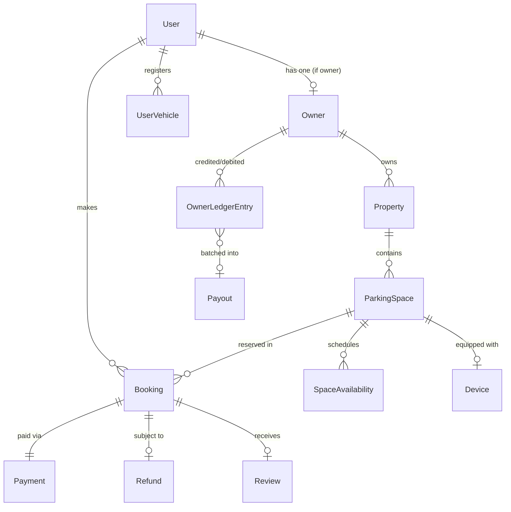

# Parkfnb — Master Product Requirements Document (PRD)
## End-to-End Product Flow, Detailed Personas & Technical Architecture

**Document Title:** Parkfnb — User, Owner & Admin Persona + End-to-End Product Flow PRD  
**Version:** 2.0 (Master Production Grade)  
**Status:** Ready for Engineering, UI/UX & Operations Handoff  
**Target Market:** India Tier-1 & Tier-2 Urban Cores (Pilot: Indore, MP)  
**Target Stakeholders:** Product Managers, Mobile Engineers (React Native), Backend Engineers (Node.js/Express/Mongo), Firmware Engineers (ESP32/C++), UI/UX Designers, Ground Ops Leads.

---

## Table of Contents
1. [Product Vision & Ecosystem Architecture](#1-product-vision--ecosystem-architecture)
2. [Role & Permission Matrix (RBAC)](#2-role--permission-matrix-rbac)
3. [Consumer Persona (Demand Side)](#3-consumer-persona-demand-side)
4. [Owner Persona (Supply Side — Types A, B, C)](#4-owner-persona-supply-side--types-a-b-c)
5. [Admin Persona (Platform Control Plane — 5 Operational Roles)](#5-admin-persona-platform-control-plane--5-operational-roles)
6. [Consumer Journey (End-to-End)](#6-consumer-journey-end-to-end)
7. [Owner Journey (End-to-End)](#7-owner-journey-end-to-end)
8. [Admin Journey & Operational Workflows](#8-admin-journey--operational-workflows)
9. [End-to-End Booking Lifecycle (The Master Flow)](#9-end-to-end-booking-lifecycle-the-master-flow)
10. [Payment & Settlement Lifecycle](#10-payment--settlement-lifecycle)
11. [Physical Access Lifecycle (BLE, QR, OTP)](#11-physical-access-lifecycle-ble-qr-otp)
12. [Device & IoT Lifecycle (ESP32 Barrier Controller)](#12-device--iot-lifecycle-esp32-barrier-controller)
13. [KYC & Listing Verification Flow](#13-kyc--listing-verification-flow)
14. [Dispute & Refund Arbitration Engine](#14-dispute--refund-arbitration-engine)
15. [Owner Ledger & Payout Engine](#15-owner-ledger--payout-engine)
16. [Screen-by-Screen Functional Specifications](#16-screen-by-screen-functional-specifications)
17. [Backend Entity & Schema Mapping](#17-backend-entity--schema-mapping)
18. [System State Machines](#18-system-state-machines)
19. [Omnichannel Notification Engine](#19-omnichannel-notification-engine)
20. [MVP vs Future Roadmap](#20-mvp-vs-future-roadmap)

---

## 1. Product Vision & Ecosystem Architecture

### 1.1 The Core Thesis
Parkfnb is **the operating layer for fragmented urban parking capacity**. Rather than being a pure listing marketplace, Parkfnb closes the loop between **digital demand** and **physical access**:

$$\text{Demand} \longrightarrow \text{Verified Inventory} \longrightarrow \text{Reservation} \longrightarrow \text{Physical Access} \longrightarrow \text{Live Occupancy} \longrightarrow \text{Settlement}$$

```
                                  PARKFNB PLATFORM
                                         │
        ┌────────────────────────────────┼────────────────────────────────┐
        │                                │                                │
     CONSUMER                          OWNER                            ADMIN
  (React Native JS)             (React Native TS)                 (React + Vite)
        │                                │                                │
   Find & Filter                   KYC & Property                  Verify KYC & Lists
        │                                │                                │
   Book & Pay                     Set Bays & Schedule              Monitor Live Ops
        │                                │                                │
   Access Pass                     Control Device                  Resolve Disputes
        │                                │                                │
  BLE / QR / OTP                   Manage Queue                    Finance & Payouts
        │                                │                                │
   Park & Exit                    Ledger & Payout                  Audit & Config
        └────────────────────────────────┼────────────────────────────────┘
                                         │
                        CENTRAL BACKEND (Express 5 + Mongo)
                                         │
               ┌─────────────────────────┴─────────────────────────┐
               │                                                   │
      IoT Hardware (ESP32)                              Edge Vision (CCTV + ANPR)
  WiFi/BLE Barriers & Locks                             Occupancy & Overstay Tracking
```

### 1.2 Core Architectural Principles
1. **Single Identity:** One unified `User` model handles both Consumers and Owners via role toggling (`roles: ['user', 'owner']`).
2. **Deterministic Physical Access:** No driver arrives at a bay without an active cryptographic grant (BLE token, signed QR, or synchronized 6-digit OTP).
3. **Immutable Financial Snapshots:** Pricing, commission rates (30%), and convenience fees are frozen in the booking record at the exact second of payment capture.
4. **Resilient Hardware Fallbacks:** If cloud MQTT is down, BLE works offline; if smartphone battery dies, the 6-digit physical keypad OTP works.

---

## 2. Role & Permission Matrix (RBAC)

| Capability / Action | Consumer (Driver) | Owner Type A (Single) | Owner Type B (Lot) | Owner Type C (Commercial) | Admin: KYC | Admin: Supply | Admin: Dispute | Admin: IoT | Admin: Finance | Super Admin |
|---|:---:|:---:|:---:|:---:|:---:|:---:|:---:|:---:|:---:|:---:|
| Search & Book Parking | ✅ | ✅ | ✅ | ✅ | ❌ | ❌ | ❌ | ❌ | ❌ | ✅ |
| Trigger BLE/OTP Gate Unlock | ✅ (Self) | ✅ (Own) | ✅ (Own) | ✅ (Staff) | ❌ | ❌ | ❌ | ✅ (Test) | ❌ | ✅ |
| Submit Property & Spaces | ❌ | ✅ (Max 2) | ✅ (Max 50)| ✅ (Unlimited)| ❌ | ❌ | ❌ | ❌ | ❌ | ✅ |
| Set Availability & Blackouts | ❌ | ✅ | ✅ | ✅ | ❌ | ❌ | ❌ | ❌ | ❌ | ✅ |
| View Financial Ledger & Payouts | ❌ | ✅ | ✅ | ✅ | ❌ | ❌ | ❌ | ❌ | ✅ | ✅ |
| Manage Staff Sub-accounts | ❌ | ❌ | ✅ | ✅ | ❌ | ❌ | ❌ | ❌ | ❌ | ✅ |
| Configure CCTV Edge AI / ANPR | ❌ | ❌ | ❌ | ✅ | ❌ | ❌ | ❌ | ✅ | ❌ | ✅ |
| Audit & Approve Owner KYC | ❌ | ❌ | ❌ | ❌ | ✅ | ❌ | ❌ | ❌ | ❌ | ✅ |
| Approve / Reject Listings | ❌ | ❌ | ❌ | ❌ | ❌ | ✅ | ❌ | ❌ | ❌ | ✅ |
| Override Bookings & Issue Refunds| ❌ | ❌ | ❌ | ❌ | ❌ | ❌ | ✅ | ❌ | ❌ | ✅ |
| Push Device Firmware / Reboot | ❌ | ❌ | ❌ | ❌ | ❌ | ❌ | ❌ | ✅ | ❌ | ✅ |
| Execute Bank Payout Batch | ❌ | ❌ | ❌ | ❌ | ❌ | ❌ | ❌ | ❌ | ✅ | ✅ |
| Modify Commission & Convenience Fee| ❌ | ❌ | ❌ | ❌ | ❌ | ❌ | ❌ | ❌ | ❌ | ✅ |

---

## 3. Consumer Persona (Demand Side)

### 3.1 Primary Goal
> *"Mujhe destination ke paas trusted parking mile, main pehle se book kar sakun aur pahunchne par bina problem ke access mil jaye."*

### 3.2 Five Concrete Demand Archetypes (From Pitch Deck)

```
                       ┌─────────────────────────┐
                       │  CONSUMER ARCHETYPES    │
                       └────────────┬────────────┘
         ┌─────────────────┬────────┴────────┬─────────────────┐
         ▼                 ▼                 ▼                 ▼
 1. Corporate       2. High-Street    3. Pilgrim /      4. Large Vehicle
    Commuter           Shopper           Tourist           & Fleet
 (Predictable,       (Spontaneous,     (Unfamiliar,      (Clearance,
  Daily Pass)         Fast UPI)         Large SUV)        Radius, Staging)
```

#### Archetype 1: Corporate Employee (The Commuter)
- **Profile:** IT / Corporate professional driving to IT parks or commercial hubs (e.g., Crystal IT Park, Indore).
- **Vehicle:** Compact SUV / Sedan / EV.
- **Pattern:** Monday to Friday, 9:30 AM to 6:30 PM.
- **Pain Point:** Cruising for 20+ mins, arriving late to work, street parking risks (scratches, towing).
- **JTBD:** Pre-book a dedicated slot within 300m walking distance on a monthly/weekly pass with EV charging.

#### Archetype 2: Shopper / Diner (The Weekend Visitor)
- **Profile:** Visiting high-density retail/food streets (56 Dukan, Sarafa, Chappan, Malls).
- **Vehicle:** Hatchback / Two-Wheeler.
- **Pattern:** Friday–Sunday evenings, 1–3 hours.
- **Pain Point:** Touts charging arbitrary cash (₹50–₹100) with zero receipts; blocked driveways; chaos.
- **JTBD:** Instant-book a guaranteed slot 15 minutes before arrival and pay seamlessly via UPI.

#### Archetype 3: Tourist / Pilgrim (The Outstation Visitor)
- **Profile:** Family traveling from out of town for temple visits or heritage sights (Mahakaleshwar corridor, Rajwada).
- **Vehicle:** Large 7-seater SUV / MPV (Innova, XUV700).
- **Pattern:** Full-day or overnight parking.
- **Pain Point:** Unfamiliar routes, narrow alleys, fear of vehicle theft or damage in unmonitored lots.
- **JTBD:** Reserve a dimension-verified, CCTV-monitored, gated bay with clear photo directions.

#### Archetype 4: Staff / Corporate Shuttle (Transit)
- **Profile:** Corporate mini-buses, school vans, or staff transport.
- **Vehicle:** 12–26 seater mini-buses / Force Travelers.
- **Pattern:** Fixed 30–45 minute scheduled staging windows during morning/evening shift changes.
- **Pain Point:** Fined for idling on main roads; need legal waiting zones with adequate turning radius.
- **JTBD:** Reserve scheduled curbside or staging bays matching exact vehicle length and height.

#### Archetype 5: Commercial Logistics & Delivery Fleet
- **Profile:** Quick-commerce and e-commerce delivery vans (Zepto, Blinkit, Amazon).
- **Vehicle:** 3-wheeler cargo / Tata Ace / EV delivery vans.
- **Pattern:** Multi-drop hubs requiring 15–30 min turnaround.
- **Pain Point:** No legal unloading zones, frequent harassment by traffic cops.
- **JTBD:** Pre-allocated micro-staging hubs reserved for specific hour blocks.

---

## 4. Owner Persona (Supply Side — Types A, B, C)

### 4.1 Primary Goal
> *"Meri unused parking capacity se income aaye aur access mere control mein rahe."*

```
                             OWNER TIERS & ASSET TYPES
                                         │
        ┌────────────────────────────────┼────────────────────────────────┐
        ▼                                ▼                                ▼
  OWNER TYPE A                     OWNER TYPE B                     OWNER TYPE C
Single Space Owner               Private Lot Owner              Commercial Operator
  (1–2 Bays)                       (10–50 Bays)                   (50–150+ Bays)
  Bungalow / Porch                 Vacant Plot / Gated Yard       Mall / Hospital / Tower
  Smart Lock (1 Bay)               Boom Barrier / Multi-Lock      CCTV Edge AI + ANPR
```

### 4.2 Detailed Owner Typology

#### Owner Type A — Single Space Owner (Residential Bungalow Host)
- **Asset Scope:** 1 or 2 bays in an independent bungalow driveway, apartment porch, or personal garage.
- **Availability:** During work hours (Mon–Fri 09:00–18:00) while owner’s car is away, or weekend daytime.
- **Access Hardware:** Single-bay battery-powered smart parking lock (bolted to floor).
- **Key Anxieties:** Family privacy, strangers lingering on property, driver overstaying past 6:00 PM.
- **Target Economics:** ₹40/hr $\times$ 4 hrs/day $\times$ 25 days = ₹4,000 GMV $\rightarrow$ ₹2,800 net payout/month.

#### Owner Type B — Private Lot Owner (Vacant Land / Small Lot)
- **Asset Scope:** 10 to 50 bays on an open plot, demolished property footprint, or commercial land bank.
- **Availability:** 24/7 or daytime commercial access.
- **Access Hardware:** Solar-powered automated boom barrier + QR totem + local security guard/attendant.
- **Key Anxieties:** Illegal boundary encroachment, unauthorized squatters, cash theft by attendants.
- **Space Optimizer Need:** Uploads plot perimeter $\rightarrow$ algorithms output optimal NBC 2016 layout with drive aisles and turning angles.
- **Target Economics:** 25 bays $\times$ ₹30/hr $\times$ 6 hrs/day $\times$ 30 days = ₹1,35,000 GMV $\rightarrow$ ₹94,500 net payout/month.

#### Owner Type C — Commercial Operator (Mall / Hospital / Tech Park / Society)
- **Asset Scope:** 50 to 150+ bays in an existing basement or multi-level parking lot.
- **Availability:** High-throughput continuous commercial operation.
- **Access Hardware:** High-speed boom barriers + existing CCTV cameras connected to Parkfnb Edge AI boxes (ANPR plate capture).
- **Key Anxieties:** 30–40% cash leakage from parking contractors, manual ticketing congestion, lack of audit trail.
- **Features Required:** Staff hierarchy (Guard, Supervisor, Manager), GST compliant B2B billing, live camera occupancy heatmaps.

---

## 5. Admin Persona (Platform Control Plane — 5 Operational Roles)

### 5.1 Primary Goal
> *"Platform par genuine supply aaye, transactions correct rahein, devices healthy rahein aur customer/owner problems quickly resolve hon."*

```
                         PLATFORM CONTROL PLANE (ADMIN)
                                         │
        ┌──────────────┬───────────────┼───────────────┬──────────────┐
        ▼              ▼               ▼               ▼              ▼
   1. KYC &       2. Supply &     3. Booking &     4. Device /    5. Finance &
   Identity        Listings         Disputes         IoT Fleet      Settlement
   Reviewer        Auditor          Desk             Telemetric     Controller
```

### 5.2 The 5 Operational Roles

#### Role 1: KYC / Verification Admin
- **Daily Operations:** Reviews submitted Aadhaar, PAN, Property Tax / Electricity Bills, and Bank IFSC.
- **Decision Engine:** Cross-checks applicant name with bank account holder name; verifies address against property tax.
- **SLA:** Complete audit within 4 hours of submission.
- **Failure Handling:** Rejection with categorized reason (e.g., `DOC_BLURRED`, `NAME_MISMATCH`, `INVALID_TITLE`) allowing 1-click re-upload by owner.

#### Role 2: Listing / Supply Admin
- **Daily Operations:** Audits submitted parking properties and bays before going public.
- **Checks:** Validates geofence pin on satellite map, verifies approach road width ($\ge 3.5\text{ m}$ for cars), confirms photo authenticity (flags stock photos), and reviews pricing sanity.
- **Space Optimizer Assist:** For vacant plots, reviews layout output before converting bays into live inventory.

#### Role 3: Booking / Support & Dispute Admin
- **Daily Operations:** Manages active escalations, overstay reports, barrier malfunction tickets, and cancellations.
- **Evidence Dossier:** Admin can inspect a complete unified incident record:
  $$\text{Incident Dossier} = \{\text{Booking Timeline}\} + \{\text{Telemetry Logs}\} + \{\text{Access Event}\} + \{\text{ANPR Capture}\} + \{\text{Chat History}\}$$
- **Power Actions:** Issue full refund, partial refund (convenience fee waived), cancel with penalty, or reassign driver to adjacent bay.

#### Role 4: Device / IoT Fleet Admin
- **Daily Operations:** Monitors telemetry across all deployed ESP32 barrier locks and gate controllers.
- **Dashboard Telemetry:** Online/Offline heartbeat, battery voltage (alert if $< 11.2\text{ V}$), WiFi/GSM RSSI, actuator cycle count, and physical tamper alarms.
- **Command Dispatch:** Can remotely trigger `REBOOT`, `CALIBRATE_LIMITS`, `EMERGENCY_OPEN_ALL`, or schedule OTA firmware updates.

#### Role 5: Finance & Settlement Admin
- **Daily Operations:** Manages the platform ledger, reconciles payment gateway inflows with bank deposits, reviews frozen commission takes, and executes batch payout disbursements.
- **P&L Integrity:** Ensures the T+48h dispute clearance hold is enforced before releasing escrow to host bank accounts.
- **Export:** Generates monthly GST reports (GSTR-1 format), TDS deductions (Section 194-O), and bank UTR upload sheets.

---

## 6. Consumer Journey (End-to-End)

```
[Onboarding]
  Phone Number ──▶ OTP Auto-verify ──▶ Profile Setup ──▶ Add Vehicle (Make, Model, Plate, Cat)
      │
[Discovery]
  Enter Destination / "Near Me" ──▶ Map + List View ──▶ Apply Filters (Price, EV, Covered, SUV)
      │
[Selection & Booking]
  Select Space ──▶ Choose Date & Time Window ──▶ Price Breakdown Freeze ──▶ Pay (UPI / Card / Wallet)
      │
[Pass Generation]
  BOOKING CONFIRMED ──▶ Access Grant Generated:
                         ├─ BLE 1-Tap Unlock Token (Auto-synced)
                         ├─ Time-limited QR Code Pass
                         └─ Fallback 6-Digit Dynamic OTP
      │
[Arrival & In-Bay]
  Turn-by-turn Navigation to Exact Bay ──▶ Arrive within [-15m, +60m] window
  ──▶ Trigger BLE Unlock / Enter Keypad OTP ──▶ Barrier Lowers ──▶ Status: 'active'
      │
[Session & Extension]
  Active Countdown Timer ──▶ 15-min Exit Reminder ──▶ [Optional: Extend Booking if slot free]
      │
[Exit & Close]
  Drive out ──▶ Barrier Detects Exit & Raises ──▶ Status: 'completed'
  ──▶ Digital Tax Invoice Sent ──▶ Star Rating & Review Prompt
```

---

## 7. Owner Journey (End-to-End)

```
[Signup & Identity]
  Phone OTP ──▶ Select Owner Type (Single / Lot / Commercial) ──▶ Upload KYC & Bank Account
      │
[Admin Verification]
  Wait for Admin KYC Review (SLA < 4 hrs) ──▶ Approved!
      │
[Property & Space Creation]
  Step 1: Property Wizard (Address, Entrance GPS Pin, Street Photos, Gate Instructions)
  Step 2: Space Wizard (Bay Dimensions, Vehicle Category, Covered/Uncovered, Surface Type)
  Step 3: Pricing Engine (Hourly Rate ₹/hr, Daily Rate, Minimum Duration)
  Step 4: Availability Engine (Mon–Sun Weekly Hours, Instant Blackout Schedule)
      │
[Device Pairing]
  Select Hardware (Smart Lock / Boom Barrier / QR Only) ──▶ Bluetooth Scan & Pair Device ID
  ──▶ Run Motor Open/Close Test ──▶ Device Linked
      │
[Admin Listing Audit]
  Admin checks satellite coordinates & photos ──▶ Approved ──▶ Status: LIVE
      │
[Booking Operations]
  Booking Alert Received (Instant Book or Request Queue) ──▶ Access Grant Dispatched to Driver
  ──▶ Driver Arrives ──▶ Device Opens Automatically ──▶ Live Occupancy Updated
      │
[Checkout & Earnings]
  Driver exits ──▶ Booking Completed ──▶ 70% Net Credited to Pending Ledger
  ──▶ T+48h Dispute Window Clears ──▶ Funds Released to Available Balance
  ──▶ Weekly Automatic Bank Transfer (UTR Recorded)
```

---

## 8. Admin Journey & Operational Workflows

### 8.1 Workflow A: KYC & Listing Onboarding Queue
1. Inbound application lands in `Admin KYC Queue`.
2. Admin clicks `Audit`: splitscreen shows owner-submitted identity proof alongside NSDL PAN verification API response.
3. If valid: Admin clicks `Approve KYC` $\rightarrow$ Owner receives SMS/Push $\rightarrow$ Unlock property creation wizard.
4. When property is submitted: `Listing Queue` triggers satellite map verification of street access.
5. Admin approves $\rightarrow$ Space becomes searchable on consumer app.

### 8.2 Workflow B: Live Dispute & Telemetry Arbitration
1. Driver raises complaint: *"Barrier failed to lower at 10:05 AM."*
2. Admin opens `Dispute Desk #DISP-8921`:
   - System fetches ESP32 telemetry: `MQTT command sent at 10:05:02`, `Actuator limit switch error code 0x4B (Obstruction/Jam)`.
   - Evidence confirms hardware malfunction, not user error.
3. Admin clicks `Issue 100% Refund` $\rightarrow$ System triggers Razorpay refund API, cancels booking, and automatically toggles Space status to `maintenance_mode` to prevent subsequent bookings.
4. Auto-dispatches ground field technician task to inspect barrier.

---

## 9. End-to-End Booking Lifecycle (The Master Flow)

The diagram below connects all three stakeholders into a single unified operational state machine:

```
       CONSUMER                         PLATFORM / ENGINE                        OWNER
          │                                     │                                  │
    Selects Slot                                │                                  │
    Clicks "Book Now" ─────────────────▶ Create Booking                             │
          │                              Status: 'awaiting_payment'                │
          │                              Start 15-Minute TTL                       │
          │                                     │                                  │
    Completes Payment ─────────────────▶ Verify Payment Webhook                    │
    (UPI / Card)                         Freeze Price Breakdown:                   │
          │                               - Base Price (₹)                         │
          │                               - Convenience Fee (₹)                    │
          │                               - 30% Platform Take                      │
          │                               - 70% Owner Escrow                       │
          │                                     │                                  │
          │                              Instant Book?                             │
          │                               ├── YES ──▶ Status: 'confirmed'          │
          │                               └── NO  ──▶ Status: 'awaiting_approval'  │
          │                                              │                         │
          │                                              └──────────────────▶ Receive Request
          │                                                                     (15m window)
          │                                                                        │
          │                                    ┌───────────────────────────────────┤
          │                                    │                                   │
          │                               [Approve]                            [Reject]
          │                                    │                                   │
          │                              Status: 'confirmed'              Status: 'cancelled'
          │                                    │                          Auto 100% Refund
          │                              Generate Access Grant                     │
    Receive Pass ◀─────────────────────── (BLE, QR, OTP)                           │
    (Pass in App)                              │                                   │
          │                                    │                                   │
    Navigate to Bay                            │                                   │
    Arrive at Gate ────────────────────▶ Hardware Verification                     │
    (BLE Ping / OTP)                     (ESP32 / Keypad)                          │
          │                                    │                                   │
    Gate Opens ◀──────────────────────── Open Actuator                             │
    Park Vehicle                               │                                   │
          │                              Status: 'active' ──────────────────▶ Live Occupancy
          │                              Timer Counting Down                       Alert
          │                                    │                                   │
    Session Ends                               │                                   │
    Exit Bay ──────────────────────────▶ Departure Detected                        │
                                         (Barrier / Loop Sensor)                   │
                                               │                                   │
                                         Status: 'completed'                       │
                                               │                                   │
    Receive Digital Tax Invoice ◀──────────────┴────────────────────────────▶ Credit Ledger:
    Submit Star Rating                                                        70% Net (Pending)
                                               │                                   │
                                      T+48h Dispute Window                         │
                                               │                                   │
                                      No Dispute Raised ─────────────────────▶ Status: Available
                                               │                                   │
                                      Weekly Payout Run                            │
                                      (RazorpayX Batch) ─────────────────────▶ Bank Deposit
                                                                              (UTR Received)
```

---

## 10. Payment & Settlement Lifecycle

### 10.1 The Monetary Formula (Frozen at Capture)
Every transaction must compute and record the following immutable values:

$$\text{Total Paid by Driver} = \text{Base Price} + \text{Convenience Fee} - \text{Promo Discount}$$

$$\text{Parkfnb Platform Take} = \text{Convenience Fee} + (\text{Base Price} \times \text{Commission Rate})$$

$$\text{Owner Escrow Payout} = \text{Base Price} \times (1 - \text{Commission Rate})$$

#### Illustrative 2-Hour Booking Breakdown:
- **Hourly Rate:** ₹40/hr $\times$ 2 hrs = ₹80.00 (`base_price`)
- **Parkfnb Convenience Fee:** ₹15.00 (`convenience_fee`, paid by consumer)
- **Promo Discount:** ₹0.00
- **Total Amount Debited from Driver:** ₹95.00 (`total_amount`)
- **Platform Commission Rate:** 30% (`commission_rate = 0.30`)
- **Platform Commission Amount:** ₹80 $\times$ 0.30 = ₹24.00 (`commission_amount`)
- **Owner Net Credit:** ₹80 $\times$ 0.70 = ₹56.00 (`owner_payout_amount`)
- **Parkfnb Total Realized Revenue:** ₹15 (fee) + ₹24 (commission) = ₹39.00 (41% blended margin)

### 10.2 Escrow & Payout Rules
1. **Currency Default:** `INR` (all database fields store paise as integers to prevent floating point issues).
2. **Escrow Hold Duration:** `T + 48 hours` from `completed_at` timestamp.
3. **Dispute Freezing:** If a dispute is raised during the 48-hour window, the ledger entry transitions to `held_in_dispute` and is excluded from payout batches until arbitration closure.
4. **Disbursement Mechanism:** RazorpayX Payout API / Direct IMPS/NEFT with automated UTR capture into the `Payout` model.

---

## 11. Physical Access Lifecycle (BLE, QR, OTP)

```
                       PHYSICAL ACCESS ENGINE
                                 │
        ┌────────────────────────┼────────────────────────┐
        ▼                        ▼                        ▼
  Primary: BLE 1-Tap       Secondary: QR Pass      Tertiary: 6-Digit OTP
  (Zero Cloud Latency)     (Visual / Attendant)     (Dead Battery Fallback)
```

### 11.1 Access Tier Specifications

#### Tier 1: Bluetooth Low Energy (BLE) Direct Unlock (Target Latency $< 1.5\text{ s}$)
- App receives a signed cryptographic payload upon booking confirmation:
  $$\text{BLE Payload} = \text{HMAC-SHA256}(\text{BookingID} + \text{SpaceID} + \text{StartTime} + \text{EndTime}, \text{SecretKey})$$
- When consumer reaches within 5 meters of barrier, app broadcasts payload over BLE advertisement.
- ESP32 barrier controller validates signature locally without requiring active internet/WiFi.

#### Tier 2: Dynamic QR Code Pass (For Lots with Attendants or Scanners)
- Rendered in Consumer App under `AccessPassQrScreen`.
- Refreshes every 30 seconds to prevent screenshot sharing.
- Encodes `booking_id`, `vehicle_plate`, and `access_window`. Scanned by owner app or optical scanner.

#### Tier 3: 6-Digit Keypad Dynamic OTP (Offline Fallback)
- Used if driver’s smartphone battery dies or Bluetooth is disabled.
- Synchronized with the lock using a time-based TOTP algorithm (valid from 15 minutes before booking until booking end).
- Driver punches the 6 digits onto the barrier’s illuminated keypad.

### 11.2 Access Window Rules
- **Early Arrival Window:** Barrier opens up to 15 minutes prior to `start_time` without extra charge.
- **Grace Period for Check-in:** Driver has 60 minutes past `start_time` to trigger entry. If not triggered within 60 minutes and no extension requested, system flags `no_show`, cancels entry grant, and releases slot.
- **Exit Grace Period:** Driver has 15 minutes past `end_time` to clear the bay. If vehicle is still present at $T + 16\text{ mins}$, overstay penalty auto-billing commences.

---

## 12. Device & IoT Lifecycle (ESP32 Barrier Controller)

### 12.1 Hardware Architecture Specifications
- **Microcontroller:** ESP32-WROOM-32 (Dual Core 240MHz, 2.4GHz WiFi + BLE 4.2).
- **Power System:** 12V 7Ah LiFePO4 Battery with optional 20W Solar Panel trickle-charger (Zero civil trenching required).
- **Actuator:** 12V DC geared planetary motor with internal current-sensing limit switches.
- **Environmental Rating:** IP67 weatherproof sealed housing with automotive-grade anti-tamper steel casing.

### 12.2 MQTT Protocol & Telemetry Schema

```
Broker: ssl://mqtt.parkfnb.com:8883
Client ID: parkbnb_barrier_{device_id}
Auth: X.509 Device Certificate + Token
```

#### MQTT Topic Structure:
1. `parkbnb/barrier/{device_id}/command` (Cloud $\rightarrow$ Device)
   ```json
   {
     "command_id": "cmd_891238",
     "action": "UNLOCK", // UNLOCK | LOCK | REBOOT | CALIBRATE
     "booking_id": "bk_67123",
     "timeout_seconds": 60,
     "timestamp": "2026-09-05T08:30:00Z"
   }
   ```
2. `parkbnb/barrier/{device_id}/status` (Device $\rightarrow$ Cloud)
   ```json
   {
     "device_id": "esp32_bay_104",
     "barrier_state": "OPEN", // OPEN | CLOSED | OPENING | CLOSING | BLOCKED
     "occupancy": true, // Optical/Inductive bed sensor
     "last_command_id": "cmd_891238",
     "tamper_detected": false
   }
   ```
3. `parkbnb/barrier/{device_id}/telemetry` (Device $\rightarrow$ Cloud Heartbeat - Every 60s)
   ```json
   {
     "device_id": "esp32_bay_104",
     "battery_voltage": 12.6,
     "battery_percent": 88,
     "charging": true,
     "rssi": -62,
     "uptime_seconds": 129480,
     "actuator_cycle_count": 1420
   }
   ```

---

## 13. KYC & Listing Verification Flow

```
                      KYC VERIFICATION SUB-SYSTEM
                                   │
         ┌─────────────────────────┴─────────────────────────┐
         ▼                                                   ▼
   OWNER SUBMITS                                       ADMIN AUDITS
1. PAN Card Image                                   1. PAN Verification API
2. Aadhaar Front/Back                               2. Aadhaar OCR & Name Match
3. Electricity Bill / Land Tax                      3. Address match against Property
4. Bank Account & IFSC Code                         4. Bank Penny-Drop Name Check
         │                                                   │
         └─────────────────────────┬─────────────────────────┘
                                   │
                         [Admin Decision Engine]
                                   │
              ┌────────────────────┴────────────────────┐
              ▼                                         ▼
         [APPROVED]                                [REJECTED]
    Owner Badge Updated                       Status: 'rejected'
    Allowed to Add Spaces                     Reason Code Picked
    Push Notification                         Owner Guided to Resubmit
```

---

## 14. Dispute & Refund Arbitration Engine

### 14.1 Dispute Trigger Categories
1. **Hardware Failure:** Barrier refused to lower despite valid booking.
2. **Squatter / Occupied Bay:** Another vehicle was parked in the reserved slot upon arrival.
3. **Misrepresentation:** Space dimensions did not match listing (SUV could not fit).
4. **Host Cancellation:** Space owner revoked access within 2 hours of arrival.
5. **Overstay Contestation:** Driver claims they left on time, but barrier logged overstay.

### 14.2 Arbitration Matrix

| Dispute Type | Primary Evidence Source | Automated Action | Admin Override Option | Refund Policy |
|---|---|---|---|---|
| Barrier Jam / Offline | Telemetry Logs (`actuator_error` / `offline`) | Auto-cancels booking | Re-routes driver to nearby bay | 100% Refund + ₹50 Wallet Apology Credit |
| Bay Blocked by Squatter | Driver Photo Upload + Camera Feed | Flags bay for enforcement | Penalizes host listing rank | 100% Instant Refund to Wallet |
| Vehicle Dimension Mismatch | Vehicle Database vs Space Dimensions | Prevents booking upfront | Re-rates bay dimensions | 100% Refund if host listed incorrect specs |
| Driver No-Show | Gate Logs (Zero access attempt recorded) | Marks `no_show` at +60m | Can reverse if driver provides medical proof | 0% Refund; Host credited 70% share |
| Driver Contested Overstay | Camera Timestamp + Barrier State Change | Audits exit image | Waives fee if camera shows exit delay caused by gate | Full waiver of overstay penalty |

---

## 15. Owner Ledger & Payout Engine

### 15.1 Ledger Schema Lifecycle
Every financial transaction produces an immutable entry in the `OwnerLedgerEntry` collection:

```
[Booking Completed] ──▶ Entry Created (type: 'earning', status: 'pending')
                             │
                      T+48 Hours Escrow
                             │
                      [Dispute Check]
                        ├── Dispute Active ──▶ status: 'held_in_dispute'
                        └── No Dispute     ──▶ status: 'available'
                                                    │
                                             Weekly Payout Batch
                                                    │
                                       RazorpayX Payout Initiated
                                                    │
                                       status: 'settled', payout_id: 'PO-8912'
```

### 15.2 Payout Batch Execution
1. Scheduled cron runs every **Tuesday 02:00 AM IST**.
2. Aggregates all `available` entries grouped by `owner_id`.
3. Minimum payout threshold: **₹500.00** (balances below rollover to next cycle).
4. Generates idempotent batch payout request to Banking Partner / RazorpayX.
5. Updates ledger records with bank UTR and generates downloadable PDF remittance advice.

---

## 16. Screen-by-Screen Functional Specifications

### 16.1 Consumer Mobile App (React Native · JavaScript)

```
apps/consumer/user/screens/
├── auth/ (SignIn, SignUp, OTPVerification)
├── home/ (HomePage)
├── search/ (SearchPage, MapView, Filter)
├── parking/ (ParkingDetailsPage)
├── booking/ (Booking, BookingHistory, RecurringBooking)
├── payment/ (PaymentSummary, PaymentMethods, Wallet)
└── reviews/ (ReviewForm, ReviewList)
```

| Screen File | Functional Purpose & Key Elements | Primary User Actions | State Triggers |
|---|---|---|---|
| `auth/OTPVerification.js` | 6-digit phone OTP input with auto SMS fill, resend countdown timer. | Enter OTP, tap Verify. | Calls `/api/auth/otp/verify`, saves JWT, routes to `HomePage`. |
| `home/HomePage.js` | Destination search bar, active reservation card, quick-category chips (Work, Mall, Temple). | Tap search, tap active pass. | Fetches user location, checks for active booking banner. |
| `search/MapView.js` | Interactive Google Maps rendering with cluster pins showing ₹/hr price badges. | Pan, zoom, tap marker. | Fetches `/api/parking-spaces/search?lat=&lng=&radius=`. |
| `search/Filter.js` | Modal sheet: vehicle category, max price slider, EV charging toggle, covered toggle. | Apply filters, reset. | Updates query parameters for map and list. |
| `parking/ParkingDetailsPage.js` | Photo carousel, entrance walkthrough, dimensional specs, ratings, pricing table. | Select time window, click "Book Now". | Validates bay availability against chosen time window. |
| `payment/PaymentSummary.js` | Itemized bill: Base Price + Convenience Fee - Discounts. Total in ₹ INR. | Choose UPI/Card/Wallet, Pay. | Freezes fee breakdown, opens Razorpay SDK. |
| `booking/Booking.js` | Active Pass Screen: Big BLE "Unlock Barrier" button, QR code, 6-digit backup code, navigation link. | Tap Unlock, Open Google Maps navigation. | Broadcasts BLE packet, triggers MQTT command `/unlock`. |
| `booking/RecurringBooking.js` | Select recurring days (Mon–Fri) for commuter monthly pass. | Set dates, buy pass. | Creates recurring booking parent record. |

---

### 16.2 Space Owner Mobile App (React Native · TypeScript)

```
apps/owner/src/screens/
├── auth/ (SignInScreen, SignUpScreen, OtpVerifyScreen, WelcomeOwnerTypeScreen)
├── onboarding/ (KycIntroScreen, DocumentUploadScreen, BankSetupScreen, KycStatusScreen)
├── listings/ (AddListingScreen, MyListingsScreen, PropertySpacesScreen, ListingDetailsScreen)
│   └── listingWizard/ (StepLocationScreen, StepPhotosScreen, StepDimensionsScreen, StepAvailabilityScreen)
├── availability/ (AvailabilityCalendarScreen, BlockoutTimeScreen)
├── bookings/ (BookingsListScreen, BookingRequestQueueScreen, BookingDetailsScreen, AccessPassQrScreen)
├── earnings/ (EarningsScreen, PayoutsScreen, TransactionsScreen)
├── emptyLand/ (LotSetupScreen - Space Optimizer)
├── staff/ (StaffScreen, RolesPermissionsScreen, IndustrialStaffRolesScreen)
└── integrations/ (IoTIntegrationsScreen, FleetManagementScreen)
```

| Screen File | Functional Purpose & Key Elements | Primary User Actions | State Triggers |
|---|---|---|---|
| `auth/WelcomeOwnerTypeScreen.tsx` | Select host category: Single Space (Type A), Lot (Type B), Commercial (Type C). | Tap card to configure app shell. | Sets user profile `owner_type`, adjusts visible modules. |
| `onboarding/DocumentUploadScreen.tsx` | Camera/Gallery upload for Aadhaar, PAN, Property Proof with document edge detection. | Capture & submit documents. | Uploads to S3, sets KYC status `pending_review`. |
| `onboarding/BankSetupScreen.tsx` | Account holder name, Account number, IFSC code, bank branch preview. | Submit bank details. | Triggers penny-drop verification test. |
| `listings/listingWizard/StepLocationScreen.tsx` | High-precision GPS pin drop, entrance instructions, street address input. | Drag pin, confirm coordinates. | Records `{ lat, lng, formatted_address }`. |
| `listings/listingWizard/StepDimensionsScreen.tsx` | Bay Length (m), Width (m), Height clearance (m), Allowed Vehicle Categories. | Enter specs, pick checkboxes. | Stores dimensions for driver vehicle matching. |
| `availability/AvailabilityCalendarScreen.tsx` | Weekly recurring schedule matrix (Mon–Sun 00:00–23:59) + 1-tap blackout button. | Toggle day hours, add blackout. | Writes to `SpaceAvailability` collection. |
| `bookings/BookingRequestQueueScreen.tsx` | Cards of incoming booking requests with 15-minute countdown clock. | 1-tap Approve, 1-tap Reject. | Calls `/api/bookings/:id/approve` or `/reject`. |
| `bookings/AccessPassQrScreen.tsx` | Scanner to read incoming driver QR passes at the gate. | Scan QR using camera. | Calls `/api/bookings/:id/checkin`. |
| `earnings/EarningsScreen.tsx` | Visual charts showing GMV, 30% Parkfnb fee, 70% Net Earnings, Next Payout Date. | Switch timeframes (Wk/Mo/Yr). | Fetches `/api/owners/:id/earnings`. |
| `emptyLand/LotSetupScreen.tsx` | Satellite plot drawing tool to run Space Optimizer layout engine for vacant land. | Draw polygon, generate layout. | Calls Python `/api/optimize` service. |
| `integrations/IoTIntegrationsScreen.tsx` | Bluetooth scanning & pairing tool for ESP32 smart locks and boom barriers. | Pair lock, run motor test. | Dispatches test MQTT payload. |

---

### 16.3 Admin Web Control Portal (React + Vite + Tailwind)

```
admin/src/pages/
├── kyc/ (KycReviewQueue, KycDetailAudit)
├── listings/ (ListingApprovalQueue, PropertyInspectionView)
├── bookings/ (LiveBookingsMonitor, BookingDetailOverride)
├── disputes/ (DisputeResolutionDesk, RefundManager)
├── devices/ (DeviceFleetMonitor, TelemetryMap, DeviceControlModal)
├── finance/ (PayoutBatchExecutor, LedgerReconciliation, CommissionSettings)
└── studio/ (SpaceOptimizerStudio)
```

| Module / Page | Functional Purpose & Key Elements | Operational Capabilities |
|---|---|---|
| **KYC Audit Desk** | Split-screen document viewer comparing uploaded PAN/Aadhaar against verified API data. | 1-Click Approve, Reject with canned reasons, Flag suspicious. |
| **Listing Approval Desk** | Satellite overlay of property coordinates, entrance street-view verification, pricing check. | Approve to live inventory, request photo reshoot. |
| **Dispute & Refund Desk** | Unified timeline: Booking details + Telemetry logs + Camera snapshots + Driver chat. | Issue 100% or partial refund, penalize host, clear dispute. |
| **IoT Fleet Monitor** | Real-time map displaying all ESP32 devices color-coded by health (Green = Online, Yellow = Low Battery, Red = Offline). | Trigger remote open, view telemetry graphs, initiate OTA firmware rollout. |
| **Finance Controller Desk** | Ledger reconciliation summary, dispute hold balances, one-click Payout Batch trigger. | Disburse bank batch, view RazorpayX UTR logs, export GST sheets. |
| **Space Optimizer Studio** | Map polygon drawing tool running the 794-line Shapely engine to auto-generate NBC 2016 bays. | Export layout CAD/PDF, batch-create parking spaces directly into database. |

---

## 17. Backend Entity & Schema Mapping

All models are stored in MongoDB using Mongoose, utilizing **snake_case** for database attributes and consistent response envelopes `{ success, data }`.



### 17.1 Critical Schema Definitions & Field Requirements

#### 1. `Booking.js` (Updated with Money Model & State Machine)
```javascript
{
  booking_uid: { type: String, unique: true }, // e.g. "BK-2026-0905-1823"
  user_id: { type ObjectId, ref: 'User', required: true },
  space_id: { type ObjectId, ref: 'ParkingSpace', required: true },
  owner_id: { type ObjectId, ref: 'Owner', required: true },
  vehicle_id: { type ObjectId, ref: 'UserVehicle', required: true },
  
  // Timing
  start_time: { type: Date, required: true },
  end_time: { type: Date, required: true },
  actual_checkin: { type: Date },
  actual_checkout: { type: Date },
  
  // Money Model (Immutable Snapshot in Paise)
  currency: { type: String, default: 'INR' },
  base_price: { type: Number, required: true }, // Rate * Hours
  convenience_fee: { type: Number, required: true }, // e.g. 1500 (₹15.00)
  discount_amount: { type: Number, default: 0 },
  total_amount: { type: Number, required: true }, // Driver pays
  
  commission_rate: { type: Number, required: true, default: 0.30 }, // 30% Snapshot
  commission_amount: { type: Number, required: true }, // Parkfnb take
  owner_payout_amount: { type: Number, required: true }, // Owner 70% share
  
  // State Machine
  status: { 
    type: String, 
    enum: ['awaiting_payment', 'awaiting_approval', 'confirmed', 'active', 'completed', 'cancelled', 'no_show', 'expired'],
    default: 'awaiting_payment'
  },
  payment_status: {
    type: String,
    enum: ['unpaid', 'paid', 'refunded', 'partially_refunded'],
    default: 'unpaid'
  },
  
  // Access Credentials
  verification_code: { type: String }, // 6-digit dynamic OTP
  qr_token: { type: String }, // Signed JWT
  ble_auth_token: { type: String },
  
  expires_at: { type: Date } // 15-minute TTL for abandoned pending bookings
}
```

#### 2. `Device.js` (New Hardware Model for ESP32 Fleet)
```javascript
{
  device_id: { type: String, unique: true, required: true }, // e.g. "esp32_barrier_091"
  space_id: { type ObjectId, ref: 'ParkingSpace' },
  owner_id: { type ObjectId, ref: 'Owner', required: true },
  device_type: { type: String, enum: ['smart_lock', 'boom_barrier', 'anpr_camera'] },
  
  mac_address: { type: String },
  firmware_version: { type: String, default: 'v1.0.4' },
  
  status: { type: String, enum: ['online', 'offline', 'tampered', 'maintenance'], default: 'offline' },
  barrier_state: { type: String, enum: ['LOWERED', 'RAISED', 'JAMMED'], default: 'RAISED' },
  battery_level: { type: Number, min: 0, max: 100 },
  battery_voltage: { type: Number },
  last_heartbeat: { type: Date },
  
  mqtt_topic: { type: String },
  ble_uuid: { type: String }
}
```

#### 3. `OwnerLedgerEntry.js` (Financial Integrity & Escrow)
```javascript
{
  owner_id: { type ObjectId, ref: 'Owner', required: true },
  booking_id: { type ObjectId, ref: 'Booking', required: true },
  entry_type: { type: String, enum: ['earning', 'refund_debit', 'penalty', 'payout_disbursement'] },
  
  amount: { type: Number, required: true }, // In Paise (₹)
  currency: { type: String, default: 'INR' },
  
  status: { type: String, enum: ['pending_escrow', 'available', 'held_in_dispute', 'settled'], default: 'pending_escrow' },
  available_at: { type: Date, required: true }, // T+48h from completion
  
  payout_id: { type ObjectId, ref: 'Payout' }
}
```

---

## 18. System State Machines

### 18.1 Booking State Machine
```
                           [User clicks "Book"]
                                    │
                                    ▼
                         ┌──────────────────────┐
                         │   awaiting_payment   │
                         └──────────┬───────────┘
                                    │
               ┌────────────────────┴────────────────────┐
     (Payment captured)                         (15 min TTL expires)
               │                                         │
               ▼                                         ▼
      [Instant Book = Yes?]                         ┌─────────┐
       ├── YES ──────────────────┐                  │ expired │
       └── NO                    │                  └─────────┘
            │                    │
            ▼                    ▼
 ┌──────────────────────┐  ┌───────────┐
 │  awaiting_approval   │  │ confirmed │
 └──────────┬───────────┘  └─────┬─────┘
            │                    │
     ┌──────┴──────┐             │ (Driver checks in within window)
 [Approved]    [Rejected]        │
     │             │             ▼
     │             │        ┌──────────┐
     ▼             │        │  active  │
┌───────────┐      │        └────┬─────┘
│ confirmed │      │             │
└─────┬─────┘      │             │ (Driver departs)
      │            │             ▼
      │            │        ┌───────────┐
      │            │        │ completed │
      │            │        └───────────┘
      │            │
      │            └─────────────┐
      │                          ▼
      │ (Grace window missed)┌───────────┐
      └─────────────────────▶│ cancelled │
                             └───────────┘
```

### 18.2 Device Barrier State Machine
```
[Barrier IDLE / RAISED] (Bay Locked)
     │
     ├── Receive Valid UNLOCK Command (BLE/MQTT/OTP)
     ▼
[Motor Moving: LOWERING] (Limit switch active)
     │
     ├── Current Spike / Obstruction Detected ──▶ Emergency Stop + Alert
     ├── Limit Switch Reached Lower Bound
     ▼
[Barrier OPEN / LOWERED] (Vehicle Enters Bay)
     │
     ├── Session Active ──▶ Keep Lowered
     ├── Checkout Detected + Bed Sensor Clear
     ▼
[Motor Moving: RAISING]
     │
     ├── Limit Switch Reached Upper Bound
     ▼
[Barrier IDLE / RAISED] (Bay Secured for Next Booking)
```

---

## 19. Omnichannel Notification Engine

| Trigger Event | Recipient | Channel | Payload Content |
|---|---|---|---|
| Booking Confirmed | Consumer | Push + WhatsApp + SMS | *"Booking confirmed at Saket Porch! Your Access Pass is ready. Tap here to navigate: [Link]"* |
| New Booking Request | Owner | Push + WhatsApp | *"New Booking Request from Innova (MP09-AB-1234) for 2 hrs. Tap to approve within 15 mins."* |
| 15-Minute Expiry Warning | Consumer | In-App + Push | *"Your parking session at Bay 4 expires in 15 mins. Tap to extend for ₹40/hr or start departure."* |
| Overstay Detected | Consumer & Owner | Urgent Push + SMS | *"ALERT: Vehicle MP09-AB-1234 has exceeded reserved time by 15 mins. Overstay penalty applied."* |
| Barrier Offline Alert | IoT Admin | Slack / Ops Portal | *"WARNING: Barrier esp32_bay_104 went offline at 09:12 AM. Last battery: 11.1V."* |
| Weekly Payout Disbursed | Owner | SMS + Email | *"₹4,280 has been deposited to your HDFC account for weekly parking earnings. UTR: 628192318."* |

---

## 20. MVP vs Future Roadmap

```
  Phase 1 (Months 1–6)            Phase 2 (Months 6–12)           Phase 3 (Months 12–18+)
┌─────────────────────────┐     ┌─────────────────────────┐     ┌─────────────────────────┐
│     INDORE CLUSTER      │     │      NETWORK SCALE      │     │       B2B & B2G         │
│ • Fix Auth & Money Model│     │ • CCTV Edge AI Vision   │     │ • Municipal B2G network │
│ • 15-min Booking TTL    │     │ • ANPR Plate match      │     │ • Space Optimizer SaaS  │
│ • Razorpay Live Gateway │     │ • Dynamic surge pricing │     │ • Inter-city EV hubs    │
│ • Smart Lock ESP32 pilot│     │ • Space Optimizer Studio│     │ • Automated towing bot  │
│ • 100 bays live (Indore)│     │ • 1,500 bays live       │     │ • 10,000+ national bays │
└─────────────────────────┘     └─────────────────────────┘     └─────────────────────────┘
```

### 20.1 Immediate Sprint Deliverables (Phase 1 / MVP)
1. **API Parity:** Implement `/api/auth/otp/send`, `/verify`, `/resend` in Express backend to sync with React Native apps.
2. **Money Architecture:** Implement 30% commission freeze, convenience fee snapshot, and switch currency default to `INR`.
3. **Abandoned Booking Fix:** Add TTL auto-expiry cron to prevent pending bookings from indefinitely blocking bays.
4. **Hardware Access Pass:** Wire up the 6-digit OTP verification and BLE unlock endpoints in both mobile apps.
5. **Admin MVP:** Launch the React/Vite Admin KYC & Dispute Portal.
